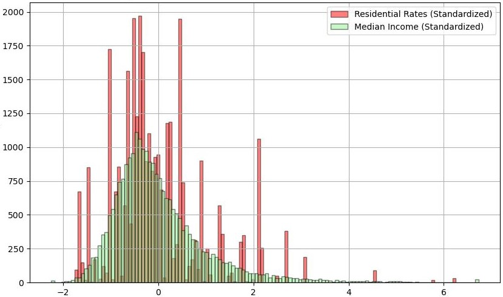

# US Census Income Data vs US Utility Rates

This project is an National Science Foundation (NSF) funded undergraduate research endeavor. It aims to uncover remarkable patterns in data that join US Census data and Utility Rates data across the United States.

# Summary
Statistical and visual methods were used to analyze two datasets. Kean University provided paid access to the Census data while the utility rate data is freely avaialble from the US Energy Information Administration. 
The statistical methods applied are z-score standardization and correlation. 
The visual methods are histograms and geo-plots. 
Both methods were accomplished using python libraries including Numpy, GeoPandas, and Sklearn. AI prompting was used for some of the scripting, which is also avaialable for view in *ideas.txt*. 
Below is the distribution of the relevant data shown in a histogram by zip code, then geographically by state. 
 
 
*above is income distribution* 
 
*above is utility rate distribution*  
The paper is available for review in this repo.